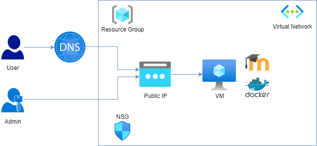
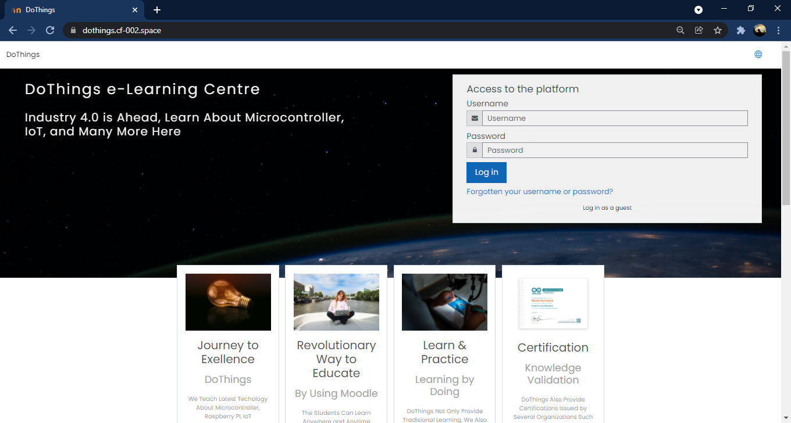
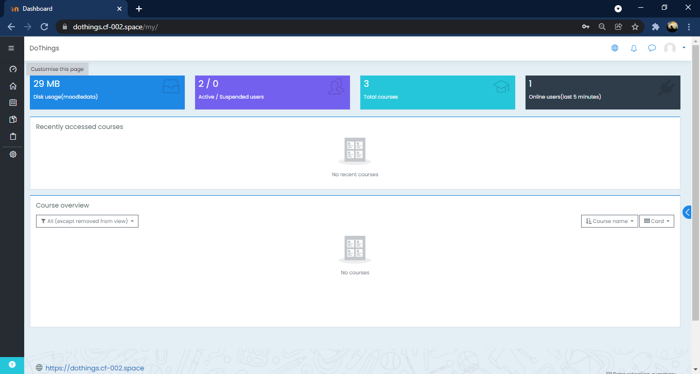
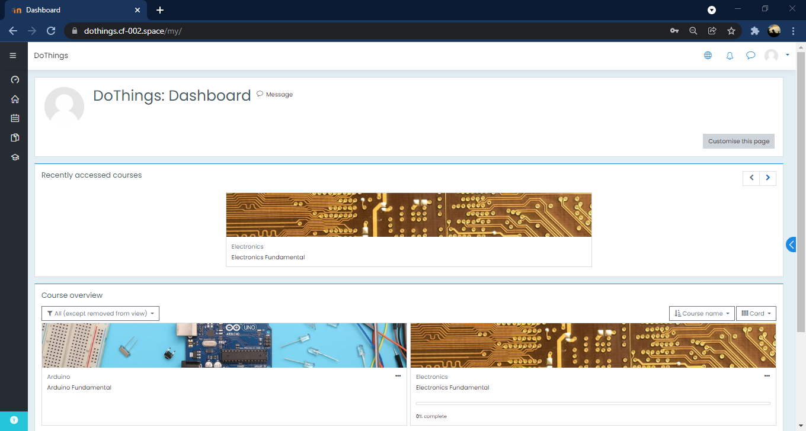
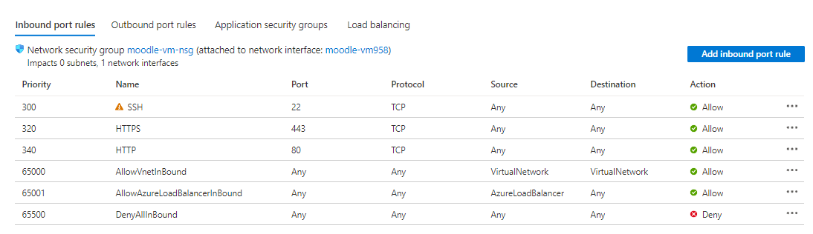

# Capstone Projet Cloud Fundamental Bidang Pendidikan
# Dokumentasi LMS Dothings

DoThings merupakan organisasi non-profit yang
DoThings merupakan organisasi non-profit yang bergerak pada bidang pendidikan yang mengusung edukasi mengenai Industri 4.0. DoThings memberikan edukasi mengenai ilmu Elektronika, IoT, Mikrokontroller, Raspberry, hingga PLC(Programmable Logic Controller).

## Arsitektur Deployment



## User Interface LMS DoThings

### Main Dashboard



### Administrator Dashboard



### Student Dashboard



## Deployment Virtual Machine untuk LMS

- Deployment menggunakan resource group bernama moodle-resources
- Deployment Menggunakan Layanan Azure Virtual Machine menggunakan Sistem Operasi Linux Ubuntu 20.04 LTS yang diberi nama moodle-vm
- moodle-vm memiliki region Asia Pacific : Asia Tenggara
- moodle-vm ini memiliki 1 availability zone
- Skema hardware yang digunakan pada VM moodle-vm merupakan D2s V3 (2 vcpus, 8 GB memory)
- Inbound Port Rules yang diperbolehkan pada VM moodle-vm adalah SSH Port 22, HTTP Port 80, dan HTTPS Port 443



## Konfigurasi Virtual Machine Melalui SSH untuk Instalasi Docker dan Moodle LMS

Akses SSH melalui CMD/putty dengan perintah

```
username@ip
```

Masuk sebagai super user di linux ubuntu

```
sudo su
```

Update repositori Linux

```
sudo apt update
```

Instalasi Docker

```
sudo apt install docker.io
```

## Instalasi Moodle pada Docker

Download script moodle

```
curl -sSL https://raw.githubusercontent.com/bitnami/bitnami-docker-moodle/master/docker-compose.yml > docker-compose.yml
```

Instalasi tool docker-compose

```
sudo apt install docker--compose
```

Install Moodle dengan perintah

```
docker-compose up -d
```

## Konfigurasi DNS pada Aplikasi LMS DoThings

Alamat web sudah memiliki DNS dengan alamat
https://dothings.cf-002.space/

**DNS dikonfigurasi menggunakan CloudFlare yang bertujuan untuk mengintegrasikan keaman SSL/TLS serta pencegaha Distributed Denial of Service.**

## Well Architected Framework pada Sumber Daya yang Dibuat

### Reliability

Dothings untuk saat ini hanya memiliki tidak lebih 150 siwa. Karena hal inilah, dari sisi reliability moodle-vm dengan skema hardware D2s V3 bisa menangani request dari user sebanyak itu. Selain itu, moodle-vm memiliki 1 availability zone sebagai toleransi ketika terjadi suatu kegagalan, dan meningkatkan Uptime SLA VM menjadi 99.99%.

### Cost Optimization

moodle-vm memiliki cost Rp 1,955.0000/hr. Dengan mempertimbangkan kemampuan virtual machine mulai dari availability zone, 2 CPU dengan memori 8 GB, maka Cost sudah optimal.

### Operational Excellence

Dari sisi moodle-vm memiliki docker yang sudah di install yang mana hal ini akan mempermudah proses produksi dan mempermudah rollback ketika kegagalan pada suatu pembaruan terjadi.

### Performance Efficiency

Disini moodle-vm menggunakan 1 availability zone yang artinya moodle-vm dapat melakukan scaling untuk menjamin kenyamanan pengguna.

### Security

Pada sisi keamanan, sumber daya ini sudah memiliki pencegahan DDOS juga menggunakan SSL SHA 256 Support TLS 1.3.
